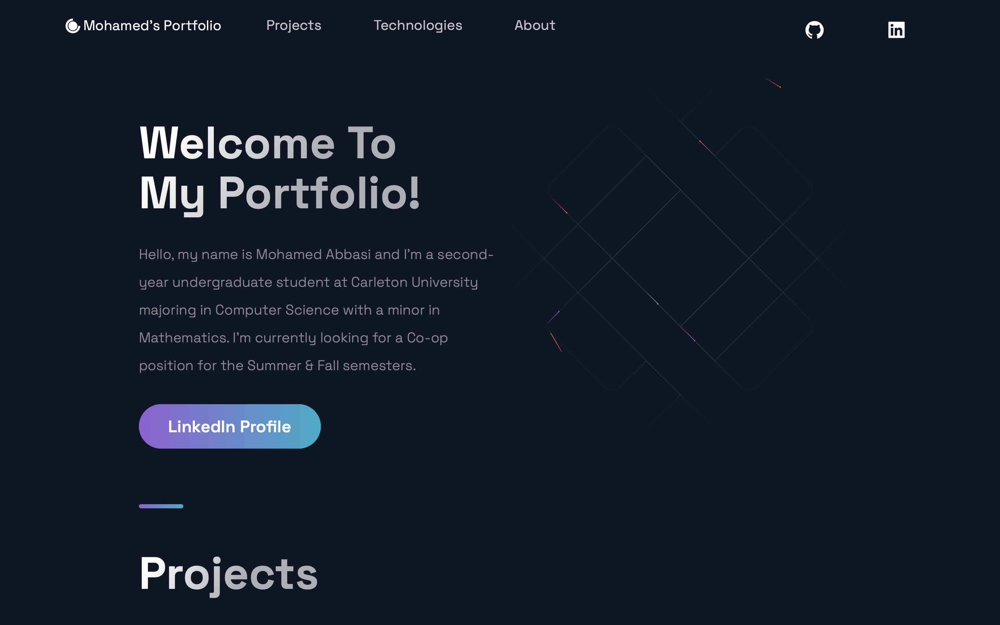

# Personal Portfolio

- A website where I get to tell you more about myself and future as a developer

## Building this Web Application improved my skills on:

- Using React.js and Next.js, primarily focusing on:
  - Enhanced Styled Components
  - Creating reusable UI components using React
- Ensuring the website is fully responsive
- Building server-side rendering using next
- Creating animations, layouts and themes
- Depolying this website using Vercel

## Sections:

- Projects: Where I talk more in depth on what projects I created and how they turned out
- Experience: This sections details the work experience I gained as a co-op student
- Technologies: I mentioned some programming languages, frameworks and courses that I'm currently studying
- About Me: Here I talk more about myself and my goals

## References and Inspiration

- This template was inspired by JavaScript Mastery.
